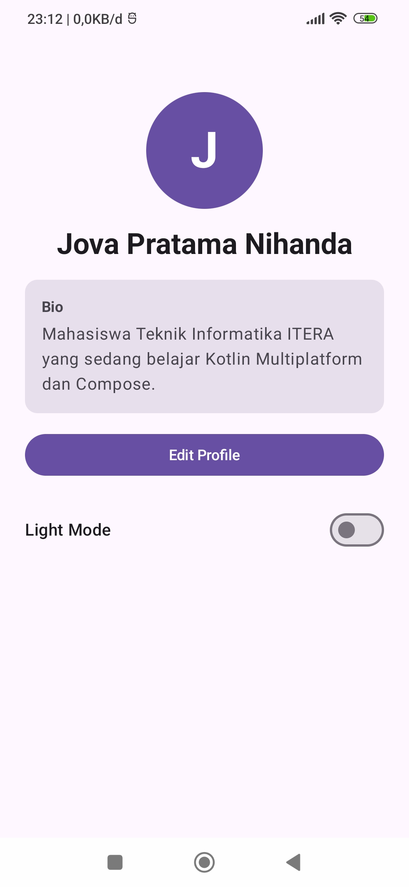
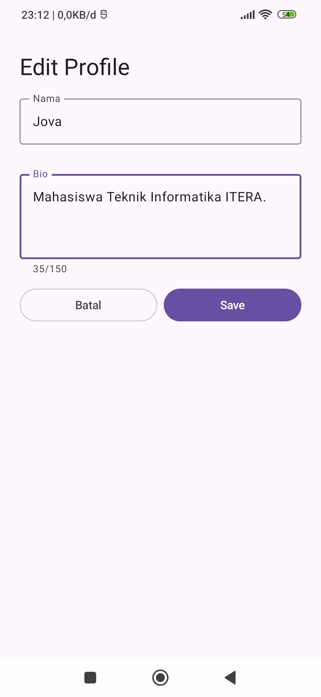
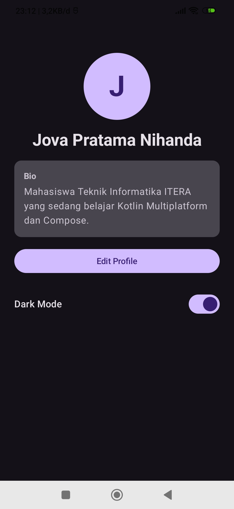

# Profile App – Pertemuan 4 (State Management & MVVM)

Pengembangan Aplikasi Mobile – Teknik Informatika, ITERA
Kotlin Multiplatform + Compose Multiplatform

## Fitur
1. **MVVM** – `ProfileViewModel` (StateFlow) + data class `ProfileUiState`
2. **Edit Profile** – form nama & bio, `LabeledTextField` stateless (state hoisting), tombol Save/Batal, validasi nama kosong, batas bio 150 karakter
3. **Dark Mode Toggle** – `Switch`, state disimpan di ViewModel, transisi warna halus (animasi)

## Struktur folder
`shared/src/commonMain/kotlin/id/ac/itera/profileapp/`
```
data/        Profile.kt                      -> Model (data class + repository)
viewmodel/   ProfileUiState.kt               -> UI State
             ProfileViewModel.kt             -> ViewModel (StateFlow)
ui/          ProfileScreen.kt                -> View: tampilan profil + switch dark mode
             EditProfileScreen.kt            -> View: form edit
ui/components/LabeledTextField.kt            -> Stateless TextField (state hoisting)
ui/theme/    AppTheme.kt                     -> Light/Dark theme + animasi warna
App.kt                                       -> collectAsStateWithLifecycle + pilih layar
```

## Screenshot

| Profile view | Edit form | Dark mode |
|---|---|---|
|  |  |  |

> Simpan screenshot dengan nama `profile.png`, `edit.png`, `dark.png` di folder `screenshots/`.

## Menjalankan
Pilih konfigurasi **androidApp**, pilih HP/emulator, lalu Run.
Atau: `./gradlew :androidApp:assembleDebug`
