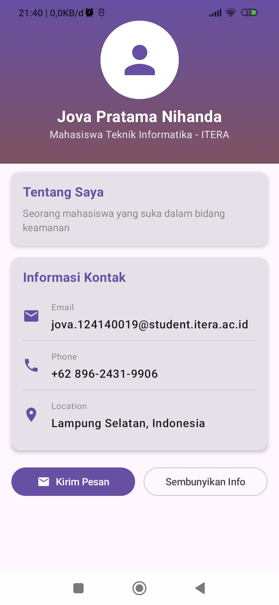
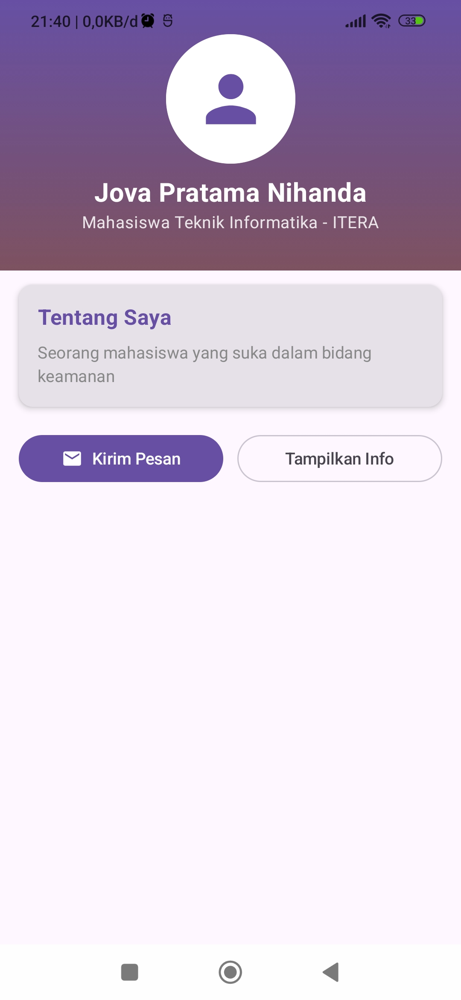

# My Profile App - Tugas Praktikum Minggu 3

Aplikasi profil sederhana menggunakan **Compose Multiplatform**.
Mata kuliah IF25-22017 Pengembangan Aplikasi Mobile - ITERA.

## Fitur
- Header dengan foto profil (circular) dan nama
- Bio / deskripsi singkat
- List informasi: Email, Phone, Location
- Tombol aksi + animasi tampil/sembunyi info kontak (`AnimatedVisibility`, bonus)

## Reusable Composables
| Composable | Fungsi |
|---|---|
| `ProfileHeader` | Banner gradient, avatar circular, nama & title |
| `InfoItem` | Satu baris info (ikon + label + nilai) |
| `ProfileCard` | Card pembungkus dengan judul dan slot konten |

## Komponen & Layout yang Digunakan
- Layout: `Column`, `Row`, `Box`
- UI: `Text`, `Button`, `OutlinedButton`, `Card`, `Icon`, `HorizontalDivider`
- Modifier: `fillMaxWidth`, `padding`, `size`, `clip`, `background`, `border`, `weight`, `verticalScroll`

## Screenshot

| Info tampil | Info disembunyikan |
|:---:|:---:|
|  |  |

## Cara Menjalankan
- Desktop: `./gradlew :desktopApp:run`
- Android: pilih konfigurasi `androidApp` di Android Studio, lalu klik Run
